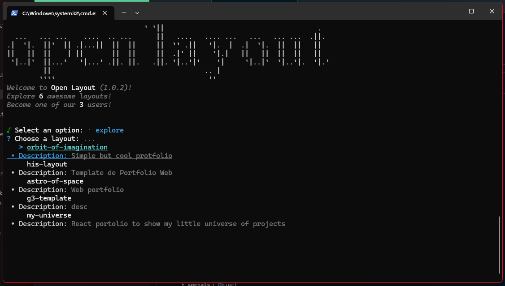

# NPM Package

You can use our cli tool to **search**, **discover**, **install** and **create** layouts with ease.

## Install open-layouts npm package


Run the following command to install the open-layouts npm package and execute it:

```bash
npx open-layout
```

The `npx` command will promt you to download `open-layout` in case its the first time and then it will run it.

Once you run it, you will see diferent options:

- `Explore Layouts` where you will be able to find the latest most popular layouts
- `Search Layouts` to search for a specific layout, or discover new ones
- `Create Layout` to create a new layout from scratch, its focused for nodejs projects but will work for any project

- `Show Help` to show the help menu with the different launch parameters
- `Open Website` to open the open-layout website
- `Open Repository` to open the open-layout repository

## Lets explore

To navigate through the different options, you can use the arrow keys and press enter to select the option.

Lets click the first option `Explore Layouts` and see what happens.



Some results will appear, you can navigate through them and press enter to see the details of the layout.