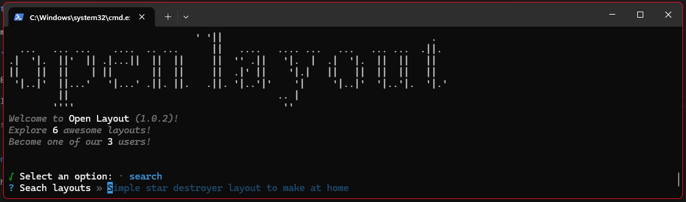

# How to download a layout

Our npm package will allow you to install a layout with 3 simple steps.

## Let's get started

Asuming you have already installed the package and run it, lets start by searching for a layout.

:::info
    We will be promped with a *random* suggestion but we can also search for a specific layout.
:::

:::tip
    Lets try searching ***portfolio*** and see what happens.
:::

## How to install a layout

> After seaching and selecting the layout we most like, we can perform diferent actions like:

:::info
    This options will **vary** depending on the layout, some will have documentation, others a demo. Its up to the developer how much they take care of the layout.
:::

> Lets select the **`Quick Install`** option by pressing the down arrow key to move to the option and then the enter key to install it.

* After loading for a few *mississippis*, the layout will be installed and we will be able to use and explore it.

:::info
    The layout will be installed in the current directory, so make sure you are in the right place before installing it.
:::

:::tip 
    If the layaout helped you, make sure to give it a star in the developers repository by clicking **`Open Repository`**
:::