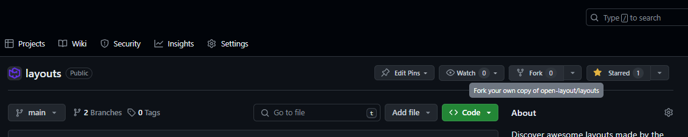
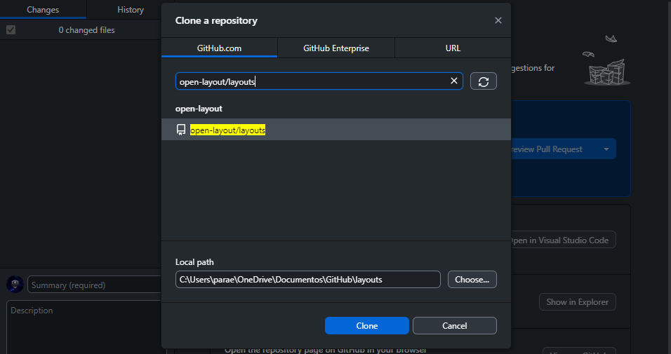
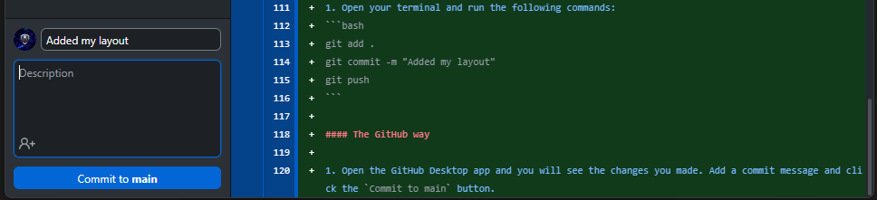
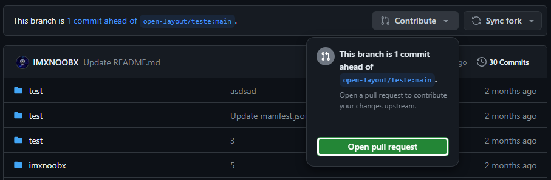
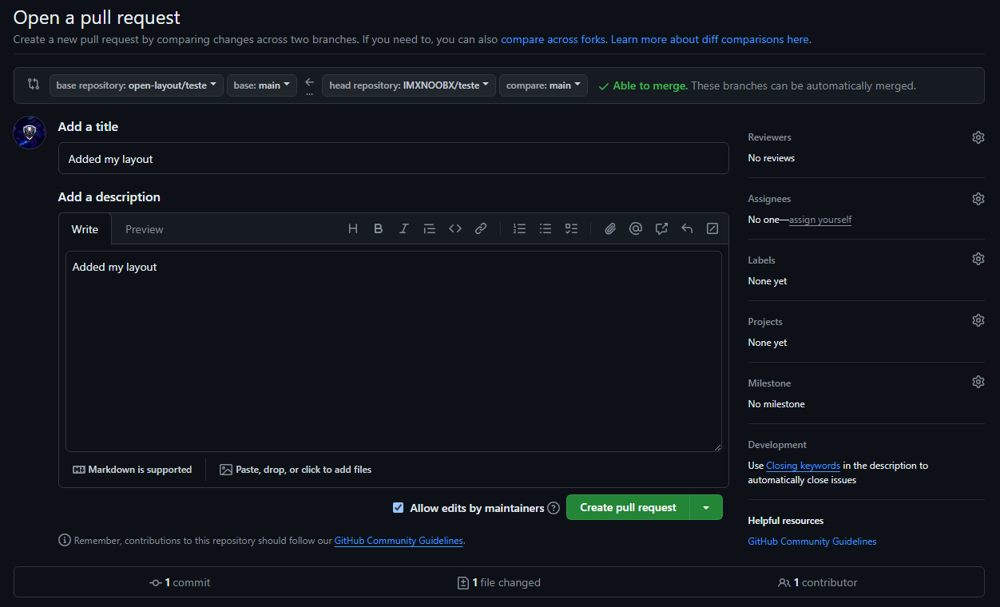
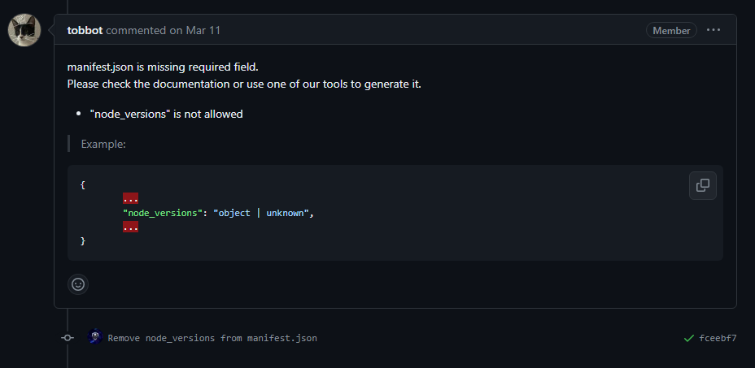
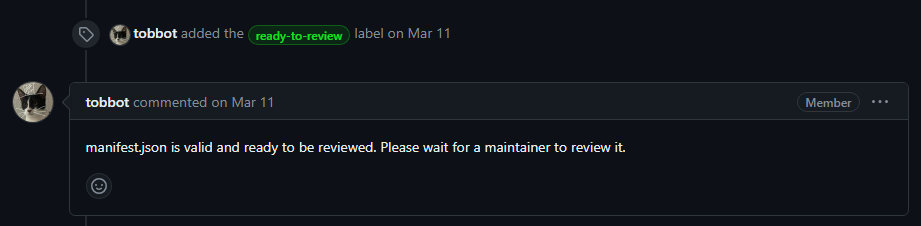

# How to share a layout

Our platform allows you to share your layouts with the community in a few simple steps. Make sure you have the following requirements:

> 1. *An **awesome** layout you want to share* (important)
> 2. *Git installed on your machine*
> 3. *A GitHub account*
> 4. ***5** minutes of your time*

# Lets Start

### Fork the repository

First of all you want to go to the [**Layouts Repository**](https://github.com/open-layout/layouts) and make a fork of the repository like in the image.

*1. Click the fork button*


*2. Click the green button*


### Clone the fork
That was easy right? Now you have a copy of the repository in your account that you will clone (download) to your local computer. This can be done in two ways, The Developer way or the GitHub way.

#### The Developer way

1. Open your terminal and run the following command:
```bash
git clone https://github.com/<your-username>/layouts.git
```

#### The GitHub way

1. Using the GitHub Desktop app, click the `Add` button and select the repository you just forked.



### Add your layout

Now that you have the repository in your computer, you will have to move into the folder that has the same name as the repository you forked. In this case, `layouts`. After that move into the `layouts` folder inside.


Now you can add your layout to the repository. You can do this by creating a new folder with the name of your layout and adding the necesary files inside. 

Necesary files:
| File              | Description                                           | Importance        |
| -----------       | -----------                                           | -----------       |
| `manifest.json`   | with the layout information you will see below        | ***REQUIRED***    |
| `README.md`       | with the description of your project                  | ***OPTIONAL***    |

### Manifest.json

What is manifest.json? This file is a JSON file that contains the information about your layout. 

This is the required information you will need to add:
```json
{
    "name": "Your Layout", // No longer than 32 characters or less than 3 characters
    "version": "1.0.0", // Use semantic versioning
    "description": "A brief description of the layout", // No longer than 256 characters
    "author": "yourgithubusername", // Your github username
    "category": "website", // ['website', 'other']
    "repository": "https://github.com/<your-username>/<your-repository>", // The repository of your layout
}
```

Some optional information you can add:
```json
{
    "collaborators": ["Collaborator1", "Collaborator2"], // List of collaborators github usernames
    "language": "en", // ['en', 'es', 'zh', 'hi', 'ar', 'pt', 'ru', 'ja', 'fr'] any from that list, more will be added in the future
    "live_preview": "https://yourlayout.github.io/", // A preview/demo of your layout, this should be a url with your project deployed
    "color_palette": { // The color palette of your layout
        "primary": "#000000",
        "secondary": "#FFFFFF",
        "accent": "#FF0000"
    }, 
    "requirements": ["nodejs", "npm"], // List of requirements
    "project_type": "website", // ['website', 'other'] more will be added in the future
    "framework": "React", // The framework used
    "languages": ["html", "css", "js"], // ['js', 'ts', 'py', 'java', 'c', 'cpp', 'csharp', 'go', ...] List of languages used
    "readme": "README.md", // The path to the readme file or url to the readme file
    "images": ["image1.png", "image2.png"], // List of images of your layout, can be relative or url to the image
    "tutorial": "https://www.youtube.com/watch?v=xvFZjo5PgG0", // A tutorial of your layout, in video format and uploaded to youtube
    "documentation": "https://docs.yourlayout.com", // The documentation of your layout
    "website": "https://yourname.com", // The developers website/portfolio
    "socials": { // The developers socials, Must be a valid username and not a url
        "github": "yourname", 
        "x": "yourname",
        "discord": "yourname"
    }
}
```

:::warning
This values are likely to change in the future. Make sure to check the latest version of the documentation. 
:::

### Push your changes

After you have added your layout to the repository, you will have to push your changes to your forked repository. This can be done in two ways again.

#### The Developer way

1. Open your terminal and run the following commands:
```bash
git add .
git commit -m "Added my layout"
git push
```

#### The GitHub way

1. Open the GitHub Desktop app and you will see the changes you made. Add a commit message and click the `Commit to main` button.



### Create a Pull Request

Now that you have pushed your changes to your forked repository, you will have to create a Pull Request to the main repository.

1. Got to [**Layouts Repository**](https://github.com/open-layout/layouts) again and click the `New Pull Request` button.
* Or go to your repository and click the contribute button and select `Open Pull Request`

2. Click open pull request (the green button) again.
3. Add a title and a description to your pull request and click the `Create Pull Request` button.


### Wait for approval

Our automated bot will verify all the data in `manifest.json` is valid and all the files are in the correct place. 

* If something is wrong, the bot will tell you what to fix.


* If everything is correct, the bot will label it as `ready-to-review` and one of our team members will review it & add it.
